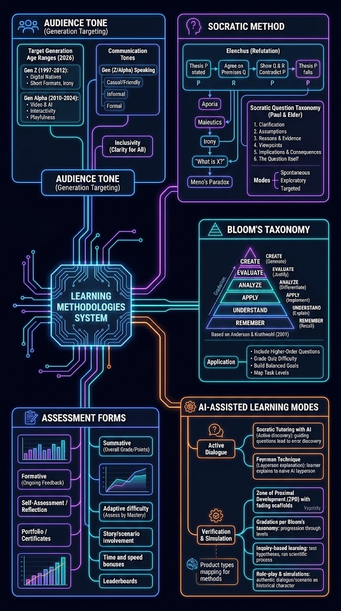

# learning-methodologies

Portable AI skill for **vibe-coders**: educational methodologies that turn
AI-built learning apps into tools that teach properly — Socratic tutoring,
Feynman technique, Zone of Proximal Development, Bloom's taxonomy, inquiry-based
learning, role-play, spaced repetition, formative assessment, and more.

Not tied to any national curriculum. Works across Big Pickle / OpenCode, Claude,
Astra, Muse, Spark, Gemini, Copilot — no build, no packages, single portable
Markdown file.

## What it does

When you are **creating or substantially extending a learning project** (quiz,
interactive lesson, simulation, trainer, exam-prep app), this skill guides the
AI to:

1. **Ask about the audience** — who the learners are, target generation (Z, Alpha),
   communication tone — instead of building a generic "for everyone" app.
2. **Pick the right teaching modes** by product type (see the matrix in
   [`docs/USAGE.md`](docs/USAGE.md)).
3. **Implement verified pedagogic methods** that make an app *teach*, not just
   test:

| Method | What it teaches |
|---|---|
| Socratic tutoring | Guided questions → learner discovers the error themselves |
| Feynman technique | Learner explains to AI as a layperson → depth check |
| ZPD + fading scaffolds | Task slightly above level, hints that grow and fade |
| Bloom's taxonomy | Gradation: remember → understand → apply → analyze → evaluate → create |
| Inquiry-based learning | Safe simulations, hypothesis testing |
| Role-play / simulations | Negotiation, argumentation in a safe AI-scenario |
| Spaced repetition | Wrong answers return to the queue until mastered |
| Error-based learning | Explain *why* the answer is wrong, not just print the right one |
| Metacognitive reflection | "Why did I pick this?" self-assessment |
| Gamification, flipped classroom, peer teaching… | Motivation & cooperation |

## Quick start

1. Grab the skill file: [`learning-methodologies.md`](learning-methodologies.md).
2. Tell your coding agent where it is (or copy it into your skills folder —
   see [Installation](docs/USAGE.md#installation)).
3. Write a normal prompt, e.g.: `Build a quiz app for 16-year-olds
   that actually teaches. Load the learning-methodologies skill.`
4. Answer the 2–3 audience/tone questions the agent asks — done.

Teacher vibe-coder? See [Teacher guide](docs/TEACHERS.md) for ready-made prompts
and how AI-assisted modes look from the student's side.

## Docs

- **[USAGE.md](docs/USAGE.md)** — how the skill works, decision matrix, installation
  per agent (OpenCode, Claude, etc.)
- **[TEACHERS.md](docs/TEACHERS.md)** — for teachers/facilitators: what each method
  is and ready-to-use prompts
- **[CHANGELOG.md](CHANGELOG.md)** — version history

## License

MIT © [Luděk Sušický](https://github.com/siberius), 2026. See [LICENSE](LICENSE).